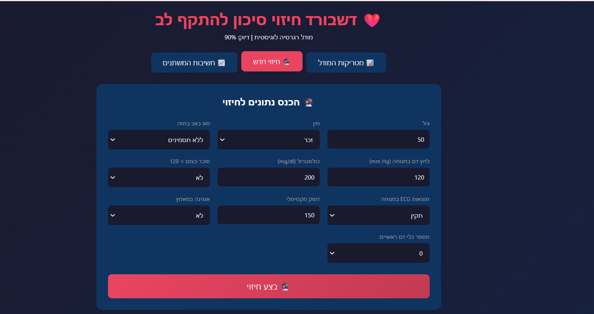
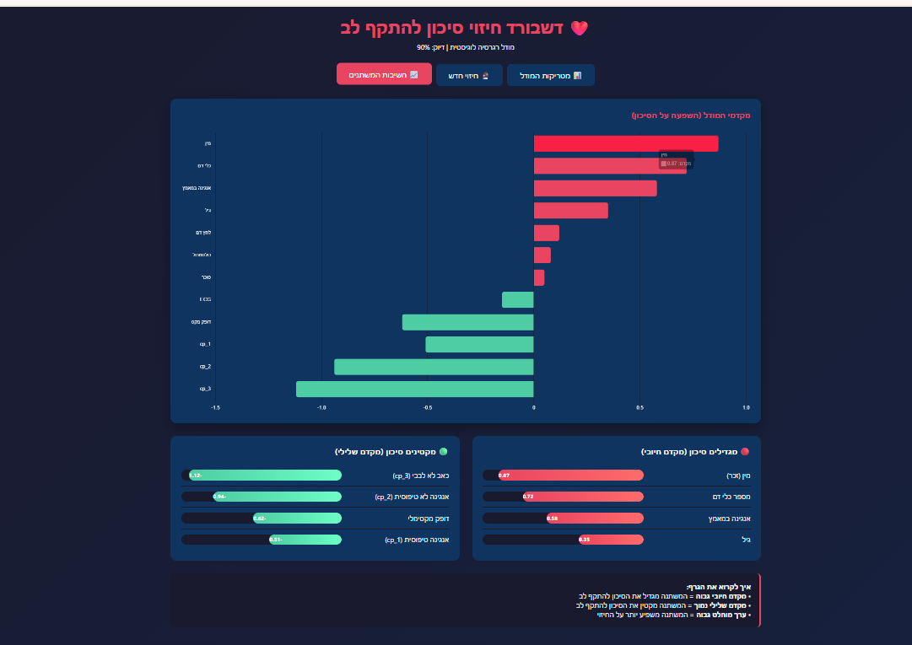

# Heart Attack Prediction

A machine learning project that predicts heart attack risk using Logistic Regression.


## Project Overview

This project uses patient medical data to predict the likelihood of a heart attack. The model achieves **90% accuracy** with a **94% recall** - critical for medical applications where missing a true positive (sick patient) can be life-threatening.

## Dashboard Screenshots

### Model Metrics


### Prediction Form


### Variable Importance


## Files

| File | Description |
|------|-------------|
| `probsolv_heart.ipynb` | Jupyter notebook with data preprocessing, model training, and evaluation |
| `Project Heart attack data.csv` | Dataset with 298 patient records and 11 features |
| `dashboard.html` | Interactive dashboard with model metrics and prediction form |
| `simple_dashboard.html` | Simplified version of the dashboard |

## Dataset Features

| Feature | Description |
|---------|-------------|
| `age` | Age in years |
| `sex` | Gender (1 = male, 0 = female) |
| `cp` | Chest pain type (0-3) |
| `trtbps` | Resting blood pressure (mm Hg) |
| `chol` | Cholesterol (mg/dl) |
| `fbs` | Fasting blood sugar > 120 mg/dl |
| `restecg` | Resting ECG results (0-2) |
| `thalachh` | Maximum heart rate achieved |
| `exng` | Exercise induced angina |
| `ca` | Number of major vessels (0-3) |
| `target` | Heart attack risk (1 = high, 0 = low) |

## Model Performance

```
              precision    recall  f1-score   support

  Low Risk       0.92      0.86      0.89        28
  High Risk      0.88      0.94      0.91        32

    accuracy                         0.90        60
```

### Confusion Matrix

```
                Predicted
              |  0   |  1  |
      --------|------|-----|
Actual   0    |  24  |  4  |  (TN, FP)
         1    |   2  | 30  |  (FN, TP)
```

| Metric | Score | Meaning |
|--------|-------|---------|
| **Accuracy** | 90% | Overall correct predictions |
| **Precision** | 88% | Of predicted positives, how many are correct |
| **Recall** | 94% | Of actual positives, how many were detected |
| **F1-Score** | 91% | Harmonic mean of precision and recall |

**Why Recall matters most:** In medical diagnosis, missing a sick patient (False Negative) is far worse than a false alarm (False Positive). Our 94% recall means we correctly identify 30 out of 32 at-risk patients.

## Key Risk Factors

### Increases Risk (Positive Coefficients)
| Factor | Coefficient |
|--------|-------------|
| Male gender | +0.87 |
| Number of major vessels | +0.72 |
| Exercise-induced angina | +0.58 |
| Age | +0.35 |

### Decreases Risk (Negative Coefficients)
| Factor | Coefficient |
|--------|-------------|
| Non-cardiac chest pain | -1.12 |
| Atypical angina | -0.94 |
| Higher maximum heart rate | -0.62 |

## Technologies Used

- Python 3
- pandas, numpy
- scikit-learn
- Jupyter Notebook
- HTML/CSS/JavaScript (dashboard)
- Chart.js (visualizations)

## How to Run

1. Open `probsolv_heart.ipynb` in Jupyter Notebook
2. Run all cells to train the model
3. Open `dashboard.html` in a browser for interactive predictions

## License

Educational project for learning logistic regression in medical applications.
